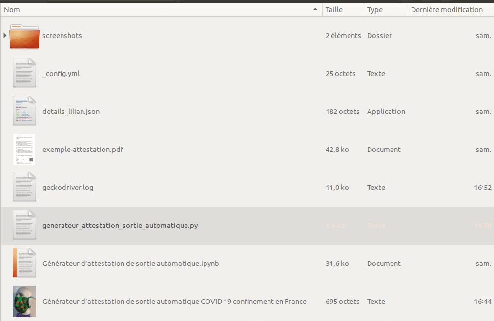
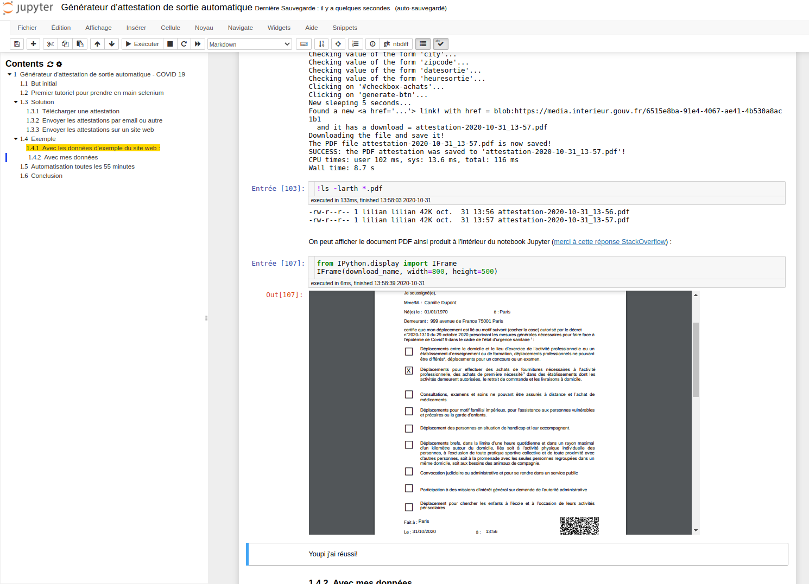
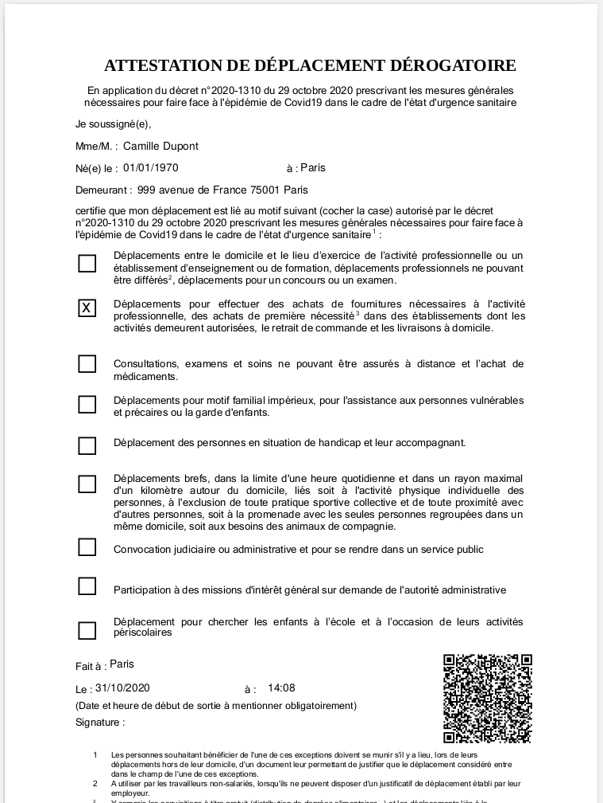

# Générateur d'attestation de sortie automatique

**Pourquoi ?**

> - *Parce qu'un bon informaticien est un informaticien flemmard*.
> - *Parce que je ne veux pas remplir plus d'une fois le même formulaire...*
> - *Parce que c'était amusant.*

## But initial

1. utiliser [Selenium](https://www.selenium.dev/) et [selenium Python](https://selenium-python.readthedocs.io/installation.html) pour automatiser l'utilisation du site [media.interieur.gouv.fr/deplacement-covid-19/](https://media.interieur.gouv.fr/deplacement-covid-19/),
2. sauvegarder le PDF localement, et l'envoyer par mail ou sur mon site web,
3. dès que ça marchera, on peut facilement automatiser cela et l'exécuter toutes les 55 minutes, histoire d'avoir toujours une attestation valide à portée de main (elles sont valides une heure...).

> Autre idée ? Le code du site web disponible sur [github.com/LAB-MI/attestation-deplacement-derogatoire-q4-2020](https://github.com/LAB-MI/attestation-deplacement-derogatoire-q4-2020), cela pourrait aussi être possible d'utiliser le code Javascript de l'application, en mode serveur (avec nodejs) et sans ouvrir de navigateur headless... C'est chiant, donc non.

## Résultat de l'expérimentation : terminée !

- Regardez [ce notebook](G%C3%A9n%C3%A9rateur%20d'attestation%20de%20sortie%20automatique.ipynb)
- [Aussi en version statique sur nbviewer](https://nbviewer.jupyter.org/github/Naereen/Generateur-attestation-de-sortie-automatique-COVID-19-confinement-en-France/blob/main/G%C3%A9n%C3%A9rateur%20d%27attestation%20de%20sortie%20automatique.ipynb)

- Et il y a [ce script](generateur_attestation_sortie_automatique.py) pour lancer ça en ligne de commande, avec [ce Makefile](Makefile) (`make run` pour lancer une fois, `make watch_run` pour surveiller et lancer toutes les 55 minutes).

Expérimental : vous pouvez lancer ce notebook en mode intéractif, [avec MyBinder](https://mybinder.org/v2/gh/Naereen/Generateur-attestation-de-sortie-automatique-COVID-19-confinement-en-France/HEAD?filepath=G%25C3%25A9n%25C3%25A9rateur%2520d'attestation%2520de%2520sortie%2520automatique.ipynb).

## Application bureau (sous GNU/Linux)

Vous pouvez télécharger le projet (`git clone ...`), le sauvegarder dans un dossier de votre choix (par exemple ̀ ~/.local/share/`), adapter le chemin absolu dans [`Generateur-dattestation-de-sortie-automatique.desktop`](Generateur-dattestation-de-sortie-automatique.desktop), pour pointer vers le dossier choisi.
Il faut changer un peu le code de [`launch.sh`](launch.sh) pour envoyer le PDF généré sur un serveur web de votre choix (ou par exemple automatiser son envoi par mail).

- Ensuite, installer l'application bureau avec ̀`sudo desktop-file-install Generateur-dattestation-de-sortie-automatique.desktop`, et elle devrait être accessible dans votre menu d'application, pour générer une nouvelle application en un clic.
- *Chez moi, ça marche*, mais je ne ferai rien de plus automatique (je peux répondre à [des questions posées comme issues](https://github.com/Naereen/Generateur-attestation-de-sortie-automatique-COVID-19-confinement-en-France/issues/new) ou [par email](https://perso.crans.org/besson/callme.fr.html)).

## Capture d'écran du notebook

Un exemple d'attestation générée depuis le notebook est [disponible ici dans ce document PDF](exemple_attestation.pdf) (remplie avec les informations par défaut du site du gouvernement).

---

## :scroll: License ? 
This repository are published under the terms of the [MIT License](https://lbesson.mit-license.org/) (file [LICENSE.txt](LICENSE.txt)).
© [Lilian Besson](https://GitHub.com/Naereen), 2020.

